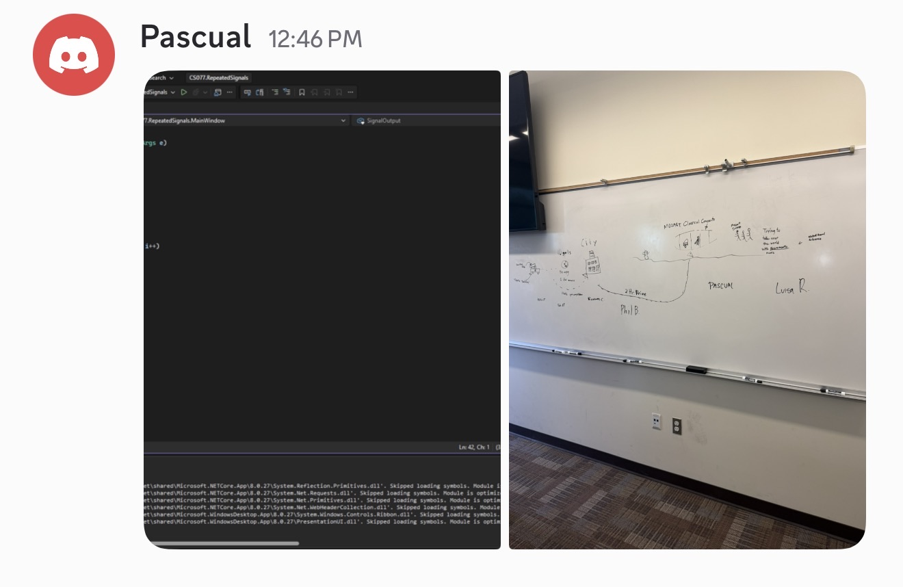

# CS077 Week 4 - Repeated Signals

This raw starter deliberately opens a plain window. Build the UI and code using the illustrated tutorial in Resources. It contains no Scan, STOP or reset implementation.

## My runner and Attention First connection

Short needs to confirm the incoming packets with a limit of 6 packets. He needs to confirm the STOP and loop in the receiver. After confirming, Short uses AI to assist an additional reset button to the receiver.

## Expected and observed tests

Short conducts a series of tests to confirm that his new code is working. The input is as follows (input, expected count, observed count): (PING;PING;DISTRESS;STOP;PING, 3, 3), (PING;PING;DISTRESS;STOP;PING;PING, 3, 3), (PING;PING;DISTRESS;STOP;PING;PING;PING, 3, 3), (PING;PING;DISTRESS;STOP;PING;PING;PING;STOP, 3, 3), (STOP; PING, 0, 0), (PING;DISTRESS;PING, 3, 3), ((EMPTY), 0 , 0), (A;B;C;D;E;F;G;H, 6, 6).

## AI question, change, test result and next step

Short asks AI to add a reset button to the receiver. AI provides a code snippet to implement the reset functionality. Short integrates the code and tests it with various inputs, confirming that the reset button works as expected. The next step is to further enhance the UI and add additional features based on user feedback.

## Whiteboard and course collaboration evidence

## How to run and sources

Open CS077.RepeatedSignals.csproj in Visual Studio on Windows with .NET desktop development. Press F5.
